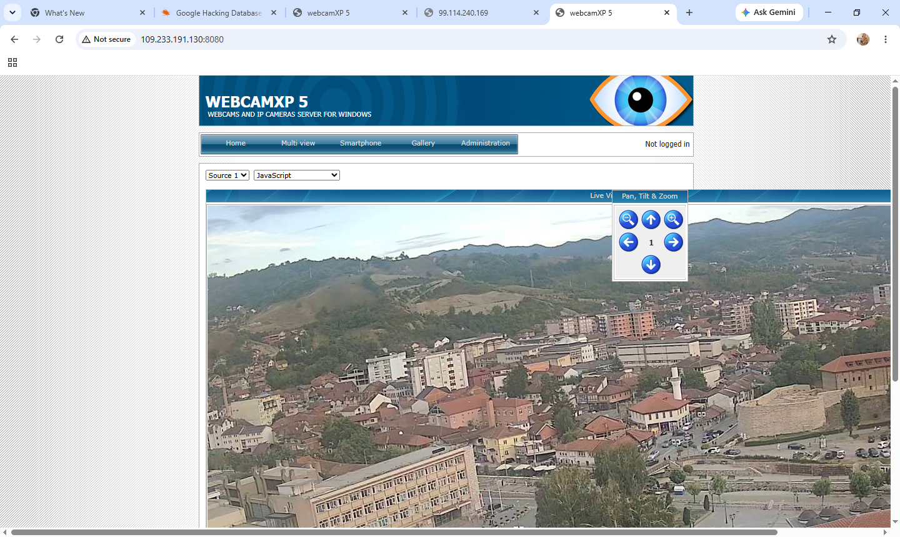
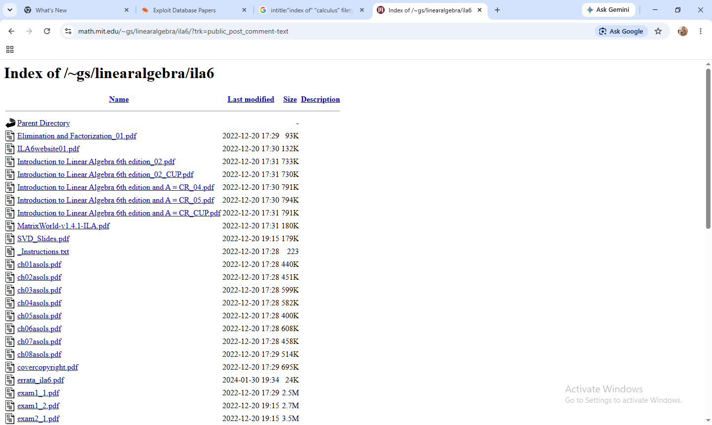
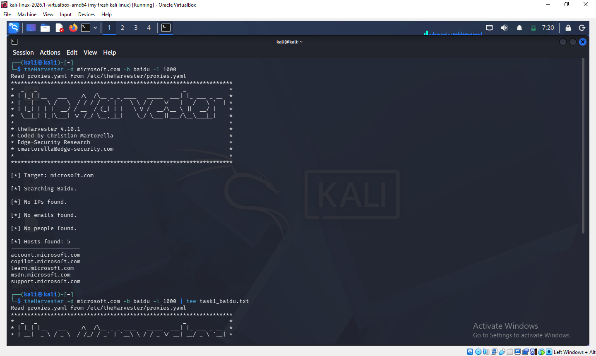
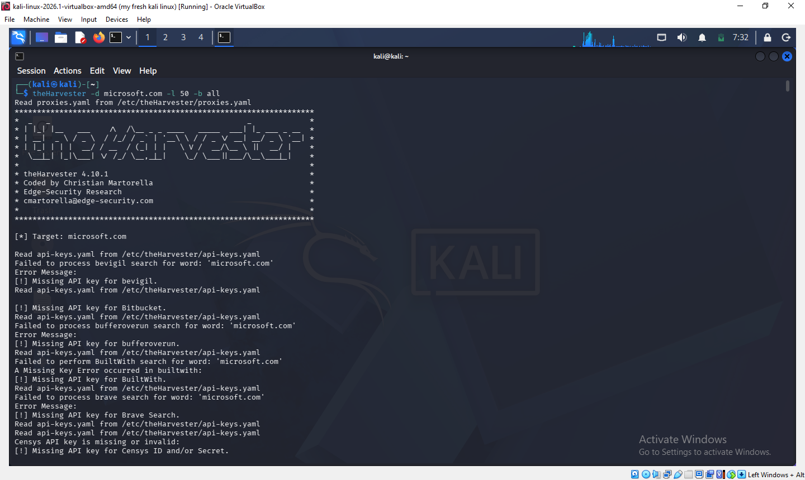
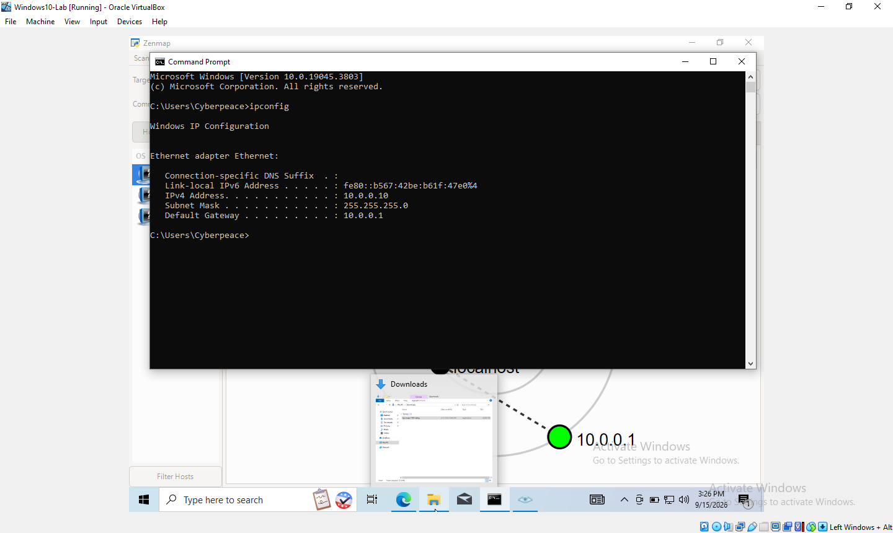
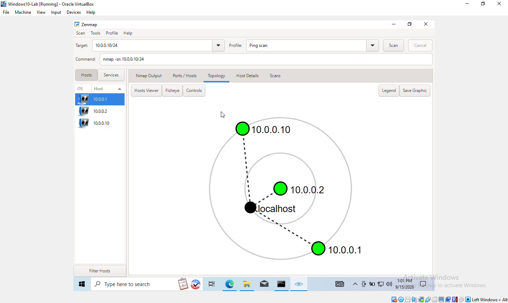

**A hands-on internship project covering OSINT footprinting with theHarvester, Google Dorking reconnaissance, and local network discovery with Zenmap.**


---

# 📋 PENETRATION TESTING REPORT

## Google Dorking, OSINT & Network Scanning Phases

**W2-PM-FINAL | CYBERSECURITY | NETWORKWALKS**

| Field | Details |
|---|---|
| **Pentester Name (Cybersecurity Professional)** | Ekpenyong Peace Inemesit |
| **Program/Batch** | B083-Networkwalks |
| **Date** | 16 September 2026 |
| **Modules completed** | W2-PM2 (Google Dorking)<br>W2-PM4 (theHarvester)<br>W2-PM5 (Zenmap Scanning) |
| **Client/Target** | 1. Publicly indexed / internet-exposed devices and files (Google Dorking)<br>2. microsoft.com (theHarvester — public OSINT sources only)<br>3. My own local LAN network (Zenmap)<br>4. Networkwalks (secured written permission already) |
| **Permission secured from client?** | Yes — activities were limited to publicly available/indexed information (OSINT) and my own local network. No systems were accessed or exploited. |
| **Phases covered** | Phase 1: OSINT / Footprinting (Google Dorking, theHarvester)<br>Phase 2: Scanning & Network Discovery (Zenmap)<br>Phase 3–5: In Progress |

---

## ⚠️ 1. Liability Disclaimer

I have performed these activities only on systems and information that were either publicly available/indexed, or on devices and networks that I own myself. All materials in this report are for educational and coursework purposes only. Do not use anything from here to break the law. The instructor, the authors and Networkwalks are not responsible for what you do with this knowledge. Every action you take is your own responsibility. Misuse can lead to criminal charges, heavy fines, loss of your job and a permanent record. In most countries, unauthorised access is a crime even when nothing is damaged.

---

## 📌 2. Introduction

This report covers Week 2 practical modules from my Cybersecurity & Ethical Hacking internship: Google Dorking / OSINT reconnaissance (W2-PM2), footprinting a target organization with theHarvester (W2-PM4), and network scanning with Zenmap (W2-PM5). Together these show the progression from finding unintentionally exposed public information, to gathering organizational footprint data from OSINT sources, to mapping live hosts on a network.

All Google Dorking and theHarvester activity was run against publicly indexed material only — no login was attempted and no system was accessed beyond what was already exposed with no authentication. The Zenmap scanning activity was performed only against my own local LAN inside a Windows 10 virtual machine.

---

## 🛠️ 3. Tools Used

| Tool | Purpose |
|---|---|
| 🔎 Google Search (Dorking) | Locate publicly indexed but unintentionally exposed devices and files using advanced search operators. |
| 🌾 theHarvester | OSINT footprinting tool used to gather emails, sub-domains and hosts related to a target organization from public sources. |
| 🗺️ Zenmap (Nmap GUI) | Scan the local subnet to find live hosts, IPs and MAC addresses; generate a network topology. |
| 💻 Windows CMD (ipconfig) | Local IP address and subnet identification. |
| Kali Linux & Windows 10 (VirtualBox) | Operating systems used to run the reconnaissance and scanning tools. |

---

## 4. Activities Performed

### 4.1 Google Dorking (W2-PM2)

**Background:** Google Dorking uses advanced search operators (`intitle`, `inurl`, `intext`, `filetype`) to find pages, files and devices that are technically public but were never meant to be easily discoverable.

**Task 1 — Find 10 live vulnerable security camera links:** Using dorks sourced from the Exploit-DB Google Hacking Database (e.g. `intitle:"webcamXP" inurl:8080`, `inurl:"ViewerFrame?" intitle:"Network Camera NetworkCamera"`, `"Camera Live Image" inurl:"guestimage.html"`), I located 10 distinct camera web interfaces that loaded a live feed with no authentication. Findings ranged from public city/tourism webcams and a radio station's outdoor camera, to a commercial pet-boarding facility and, concerningly, what appeared to be at least one private residence. One host (ViewerFrame) even exposed full pan/tilt/zoom control with no login.

| No. | Link | Relevant Dork Used | Username/Password (if any) |
|---|---|---|---|
| 1 | http://109.233.191.130:8080/multi.html | `intitle:"webcamXP" inurl:8080` | None |
| 2 | http://xx.xx.255.183.164:8080/multi.html *(partial IP recorded)* | `intitle:"webcam 7"` | None |
| 3 | http://68.115.218.130:32479/multi.html | `inurl:"/multi.html" intitle:"webcam"` | None |
| 4 | http://80.152.138.183/ViewerFrame?Mode=Motion&Language=0 | `inurl:"ViewerFrame?" intitle:"Network Camera NetworkCamera"` | None |
| 5 | http://109.206.96.75:8080/gallery.html | `intitle:"webcam 7" inurl:8080 -intext:8080` | None |
| 6 | http://109.164.203.165/cgi-bin/guestimage.html | `"Camera Live Image" inurl:"guestimage.html"` | None |
| 7 | http://72.199.200.5:8080 | `intitle:"webcamxp" "Flash JPEG Stream"` | None |
| 8 | http://97.68.208.234:1029/img/main.cgi?next_file=main.htm | `intitle:"camera linksys" inurl:main.cgi` | None |
| 9 | http://139.64.168.120:8080 | `intitle:"webcamxp 5" intext:"live stream"` | None |
| 10 | http://75.149.26.30:1024 | `inurl:"mobile.html" intitle:"webcamxp"` | None *(admin panel on this host is separately password-protected)* |

*Table 1: Exposed live camera feeds found via Google Dorking*

**Task 2 — Find 10 listings with downloadable mathematics PDF ebooks:** Using open-directory dorks (`intitle:index.of "<topic>" pdf` across linear algebra, statistics, differential equations and calculus), I located 10 open directory listings hosted by universities, personal academic pages and textbook companion sites, each containing downloadable mathematics PDFs.

| No. | Link | Relevant Dork Used |
|---|---|---|
| 1 | https://www.skylineuniversity.ac.ae/pdf/math/ | `intitle:index.of "parent directory" mathematics pdf` |
| 2 | https://theswissbay.ch/pdf/Maths/Linear%20Algebra/ | `intitle:index.of "linear algebra" pdf` |
| 3 | https://www.aerostudents.com/courses/linear-algebra/ | `intitle:index.of "linear algebra" pdf` |
| 4 | https://math.mit.edu/~gs/linearalgebra/ila6 | `intitle:index.of "linear algebra" pdf` |
| 5 | https://theswissbay.ch/pdf/Maths/Statistics/ | `intitle:index.of "statistics" pdf` |
| 6 | https://ugcmoocs.inflibnet.ac.in/assets/uploads/67/261/8262/et | `intitle:index.of "differential equations" pdf` |
| 7 | http://www.aetkin.com/files/Math%20150%20Calculus%20I/Advanced%20Calculus%20Textbook/ | `intitle:index.of "calculus" pdf` |
| 8 | https://www.aerostudents.com/courses/calculus-1-b/ | `intitle:index.of "calculus" pdf` |
| 9 | https://stewartcalculus.com/data/CALCULUS%206E/upfiles/projects/ | `intitle:index.of "calculus" pdf` |
| 10 | https://people.math.wisc.edu/~jwrobbin/calculus/ | `intitle:index.of "calculus" pdf` |

*Table 2: Open directories exposing downloadable mathematics PDFs*

### 4.2 Footprinting with theHarvester (W2-PM4)

**Background:** theHarvester is a footprinting tool pre-installed in Kali Linux that gathers emails, sub-domains, hosts and other information about a target organization from public sources such as search engines, certificate transparency logs and breach-intelligence databases.

**Task 1 — Baidu source, limit 1000:**
```
theHarvester -d microsoft.com -b baidu -l 1000
```
Result: No IPs, no emails and no people found. 5 hosts found — `account.microsoft.com`, `copilot.microsoft.com`, `learn.microsoft.com`, `msdn.microsoft.com`, `support.microsoft.com`. The sparse result is expected, since Baidu primarily indexes Chinese-language content and returns limited data for a US-based domain.

**Task 2 — All sources, limit 50:**
```
theHarvester -d microsoft.com -l 50 -b all | tee task2_all.txt
```
Result: The scan queried every free source available (Chaos, Certspotter, Baidu, Duckduckgo, CRTsh, Hackertarget, Hudson Rock, Commoncrawl, Leaklookup, Leakix, Otx, Rapiddns, Subdomaincenter, Robtex), while premium sources requiring paid API keys (Tomba, Venacus, VirusTotal, WhoisXML, ZoomEye, Fofa, SecurityScorecard, BuiltWith, LeakIX) were automatically skipped with a "Missing API key" notice. The Hudson Rock module reported domain statistics of 601,796 total compromised records and extracted 43 hosts from employee URLs found in breach data. The full saved output (`task2_all.txt`) totalled **10,303 lines**, including numerous subdomains and some hosts with resolved IPs, for example `zeus.buddy.microsoft.com:131.107.86.4` and `yakko.buddy.microsoft.com:131.107.86.17`.

### 4.3 Network Scanning with Zenmap (W2-PM5)

For the third activity, I used Zenmap inside a Windows 10 virtual machine (VirtualBox, Bridged Adapter) to perform network discovery on my own local network.

- **Task 1 — Install Zenmap:** Downloaded and installed Zenmap (bundled with Nmap and Npcap) from the official site, https://nmap.org/download.html.
- **Task 2 — Local IP and LAN subnet:** Using Windows `ipconfig`, I identified IPv4 Address `10.0.0.10`, Subnet Mask `255.255.255.0` and Default Gateway `10.0.0.1`, giving a subnet of `10.0.0.0/24`.
- **Task 3 — Find live hosts:** I entered the target `10.0.0.10/24` into Zenmap and selected the **Ping scan** profile, which ran the command:
  ```
  nmap -sn 10.0.0.10/24
  ```
- **Task 4 — Number of live hosts:** 3 hosts up out of 256 IP addresses scanned, completed in 9.69 seconds.
- **Task 5 — IP addresses of live hosts:** `10.0.0.1`, `10.0.0.2`, `10.0.0.10`
- **Task 6 — MAC addresses of live hosts:**
  - `10.0.0.1` → `52:54:00:12:35:00` (QEMU virtual NIC)
  - `10.0.0.2` → `08:00:27:92:7A:6D` (Oracle VirtualBox virtual NIC)
  - `10.0.0.10` is the scanning machine itself, so no self-MAC is reported by Nmap.
- **Task 7 — Topology export:** I opened the Topology tab in Zenmap, used the Controls panel to size the graph, then used Save Graphic to export the topology as a PDF to the desktop.

---

## 5. Risk Analysis / Impact

Based on the information collected during the Google Dorking, theHarvester and Zenmap activities, I identified the following potential risks.

| # | Risk / Finding | Evidence / Observation | Potential Impact | Risk Level |
|---|---|---|---|---|
| 1 | Unauthenticated live camera feeds exposed to the internet | 10 distinct webcamXP/Webcam 7/network-camera installs located via Google dorking, loading a live feed with no login required | Anyone on the internet can view (and in one case, pan/tilt/zoom) live camera feeds, including at least one apparent private residence | 🔴 **Critical** |
| 2 | Open directory listings exposing downloadable material | 10 open "index of" directories found via Google dorking containing downloadable mathematics PDF textbooks | Low direct security risk here, but demonstrates how misconfigured directory indexing can expose unintended files (potentially sensitive ones on other targets) | 🟡 Low |
| 3 | Public subdomain / host enumeration of a large organization | theHarvester (all sources, limit 50) returned 10,303 lines of subdomains/hosts for microsoft.com from free OSINT sources; Hudson Rock module found 43 hosts tied to breach-related employee data | Attackers can use this to map an organization's external attack surface and identify internal naming conventions, environments (uat/prd) and legacy systems | 🟠 Medium |
| 4 | Multiple live hosts visible on local network | Zenmap ping scan identified 3 live hosts (10.0.0.1, 10.0.0.2, 10.0.0.10) on the 10.0.0.0/24 subnet with resolvable MAC addresses | Unknown or unauthorized devices could potentially join a poorly segmented network undetected if not regularly monitored | 🟡 Low |

The risks above are observations from OSINT, footprinting and scanning exercises, not confirmed exploited vulnerabilities. No exploitation, login attempts or credential guessing were performed as part of any of these three modules — camera feeds and directories that required authentication were left alone and simply noted as protected.

Even where no login was required, the mere presence of a live, unauthenticated feed or a large public host inventory does not by itself constitute a confirmed compromise — it demonstrates exposure that a malicious actor could exploit, and is reported here purely for awareness and remediation purposes.

---

## 6. Recommendations

Based on the observations from these activities, I recommend the following security improvements:

1. **Disable or password-protect any camera/DVR web interface** before connecting it to the internet directly — never rely on the manufacturer's default "no password" configuration.
2. **Place IP cameras and similar IoT devices behind a VPN or firewall rule** rather than exposing them directly to the public internet.
3. **Regularly audit your own domain/organization** using the same free OSINT tools (Google dorking, theHarvester) that an attacker would use, to see what is already publicly discoverable.
4. **Disable directory indexing (autoindex)** on web servers unless a directory listing is intentionally meant to be public.
5. **Review and rotate subdomains/hosts** that are no longer in active use, since abandoned subdomains are a common attack vector (subdomain takeover).
6. **Perform regular internal network discovery** — organizations should periodically scan their own networks to identify active devices.
7. **Investigate any unknown or unexpected device** discovered during network scanning.
8. **Maintain up-to-date network documentation**, including topology and device inventories.
9. **Perform all security testing only against systems and networks** where appropriate authorization has been provided, or that are your own.

---

## 7. Conclusion

During Week 2 of my Cybersecurity & Ethical Hacking internship, I completed practical activities covering OSINT/Google Dorking, organizational footprinting and network scanning.

In the Google Dorking activity, I learned how advanced search operators can surface devices and files that were never meant to be easily found, including unsecured live camera feeds and open directories of downloadable material. This showed me how much information is exposed purely through misconfiguration, without any "hacking" in the traditional sense.

In the theHarvester activity, I learned how a single free tool can aggregate emails, subdomains and hosts about an organization from many public sources at once, and how quickly that picture grows once every free data source is queried together.

In the Zenmap activity, I learned how to identify my own local network configuration, discover active hosts, and collect their IP and MAC addresses to build a network topology.

Across all three modules, the key lesson was the same: a large amount of useful reconnaissance data is available from purely public, non-intrusive sources before any exploitation is ever attempted. Finally, I learned that OSINT gathering and scanning must always be limited to information that is genuinely public, or to networks and systems I own or am authorized to test — activities in this report were completed strictly within that scope as part of the assigned educational cybersecurity lab.

---

## 8. Evidence Collected

### Screenshot 1 — Google Dorking Task 1: Exposed Camera Feed

This screenshot shows the result obtained during the GHDB/Google Dorking practical exercise involving a publicly accessible camera interface.



---

### Screenshot 2 — Google Dorking Task 2: Open PDF Directory Listing

This screenshot shows a publicly indexed directory containing downloadable PDF mathematics resources identified during the Google Dorking exercise.



---

### Screenshot 3 — theHarvester Task 1 terminal output: Baidu search, 5 hosts found

This screenshot shows theHarvester output from the search-engine reconnaissance exercise, including the discovered hosts and related information.



---

### Screenshot 4 — theHarvester Task 2 terminal output: all-sources scan and task2_all.txt line count

This screenshot shows theHarvester output from the multi-source reconnaissance scan and the resulting collected information.



---

### Screenshot 5 — Windows ipconfig output showing IPv4 Address, Subnet Mask and Default Gateway

This screenshot shows the Windows 'ipconfig' output, including the IPv4 address, subnet mask, and default gateway used for the network-scanning practical.



---

### Screenshot 6 — Zenmap Nmap Output tab showing the ping scan results and MAC addresses

This screenshot shows the Zenmap Nmap scan results, including the discovered hosts and available network information from the authorized lab environment.


---

### Screenshot 7 — Zenmap Topology tab with Save Graphic

This screenshot shows the network topology generated by Zenmap using the result of the Nmap scan.


 
---

**Author**
Ekpenyong Peace
Cybersecurity Professional B083

**Project Information**
Program Name: Cybersecurity program at Networkwalks | Week: 02 | Repository: GitHub

-End-
